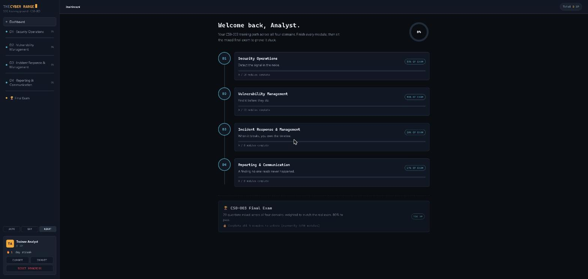

# The Proving Grounds — Self-Paced Security Training

**[Launch The Proving Grounds →](https://terrillpotts.github.io/proving-grounds/)**

An interactive, HTB/THM-style training platform organized into three independently-tracked topic areas: **Cybersecurity**, **Cloud**, and **Networking**. XP, rank, and streak are tracked separately per track. Built as a single self-contained HTML file — no backend, no build step, no dependencies.

## What it is

**Cybersecurity** is fully built out as a CompTIA CySA+ (exam CS0-003) curriculum — lessons, hands-on terminal labs, and quizzes across all four exam domains, capped with a mixed final exam. **Cloud** and **Networking** are placeholder tracks reserved for future content.

- **4 exam domains** (under Cybersecurity), each with lessons, hands-on terminal-style labs, and a capstone investigation:
  - **D1 — Security Operations**: log/architecture analysis, indicators of compromise, threat intel & hunting, phishing/email security, SOC tooling & automation
  - **D2 — Vulnerability Management**: scanning & CVSS, prioritizing beyond CVSS (EPSS, exposure, zero-days), cloud/container vulnerabilities, web app vulnerability classes (XSS, injection, SSRF, RCE), scanning tools & frameworks
  - **D3 — Incident Response & Management**: attack frameworks (Kill Chain, Diamond Model, ATT&CK), the IR lifecycle, containment/eradication/recovery, digital forensics fundamentals
  - **D4 — Reporting & Communication**: audience-aware reporting, vulnerability & incident report structure, legal considerations, metrics that matter (KPIs/KRIs, MTTD/MTTR)
- **XP, rank, and streak progression** — 7,500 XP available across all domains and the final exam, with a rank ladder from Trainee Analyst to SOC Director
- **20-question final exam**, pooled from every domain's quiz bank and weighted to match the real CS0-003 blueprint (33/30/20/17% by domain), gated behind 100% domain completion. 80% to pass earns a permanent "CySA+ Certified" badge.
- **Content aligned to the official CompTIA CySA+ CS0-003 Exam Objectives (v6.0)** — every numbered sub-objective (1.1–4.2) is covered by at least one lesson or lab.

## Try it

Open **[terrillpotts.github.io/proving-grounds](https://terrillpotts.github.io/proving-grounds/)** — progress auto-saves to your browser's local storage. Use the Export/Import buttons in the sidebar to carry progress between devices (there's no server-side account system, so this is manual).

## Architecture

Everything lives in one file, `index.html`, in a single `<script>` tag:

- `QUIZZES` / `LESSONS` / `LABS` — content banks, keyed by lesson/lab id
- `DOMAINS` — the 4 domains, each an ordered list of nodes (lessons/labs) with XP values and unlock sequencing
- `EXAM_POOL` / `buildExam()` — final exam questions, drawn from the same `QUIZZES` data (nothing duplicated)
- `state` — progress persistence via `localStorage`, plus JSON Export/Import
- a small hand-rolled router (`render()` / `view`) — no framework, no build step

## Running it locally

It's a static file — open `index.html` directly in a browser, or serve the folder with any static file server.

## License

No license file yet — all rights reserved by default. Open an issue if you'd like to reuse this for your own studying.
